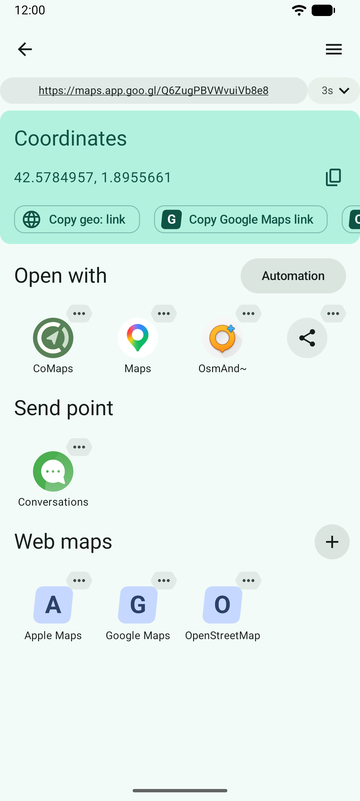
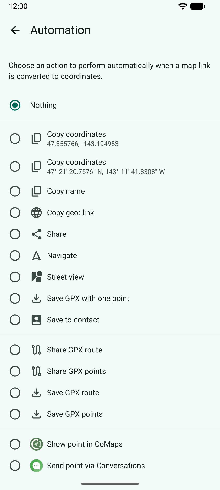
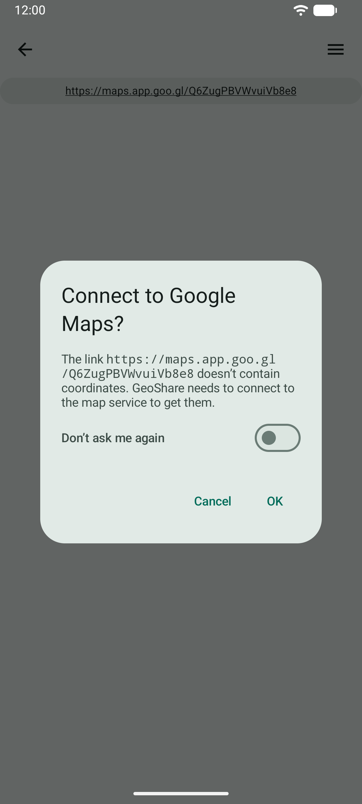

#  GeoShare: Jump Between Maps

An Android app to open map links in other map apps and copy coordinates.

[](https://f-droid.org/packages/page.ooooo.geoshare/)
[](https://apt.izzysoft.de/packages/page.ooooo.geoshare)

If you’d like to help getting the app published on **Google Play**, write me an
email to `jakub at jakubvalenta dot cz` and I’ll invite you to the testing
program.

[](https://f-droid.org/packages/page.ooooo.geoshare/)
[![Izzy on
Droid](https://img.shields.io/endpoint?url=https://apt.izzysoft.de/fdroid/api/v1/shield/page.ooooo.geoshare&label=IzzyOnDroid&logo=data:image/png;base64,iVBORw0KGgoAAAANSUhEUgAAADAAAAAwCAMAAABg3Am1AAADAFBMVEUA0////wAA0v8A0v8A0////wD//wAFz/QA0/8A0/8A0/8A0/8A0v///wAA0/8A0/8A0/8A0/8A0//8/gEA0/8A0/8B0/4A0/8A0/8A0/+j5QGAwwIA0//C9yEA0/8A0/8A0/8A0/8A0/8A0/+n4SAA0/8A0/8A0/+o6gCw3lKt7QCv5SC+422b3wC19AC36zAA0/+d1yMA0/8A0/+W2gEA0/+w8ACz8gCKzgG7+QC+9CFLfwkA0/8A0////wAA0/8A0/8A0/8A0/+f2xym3iuHxCGq5BoA1P+m2joI0vONyiCz3mLO7oYA0/8M1Piq3Ei78CbB8EPe8LLj9Ly751G77zWQ1AC96UYC0fi37CL//wAA0/8A0////wD//wCp3jcA0/+j3SGj2i/I72Sx4zHE8FLB8zak1kYeycDI6nRl3qEA0/7V7psA0v6WzTa95mGi2RvB5XkPy9zH5YJ3uwGV1yxVihRLiwdxtQ1ZkAf//wD//wD//wD//wD//wCn5gf//wD//wD//wD//wD//wAA0/+h4A3R6p8A0/+X1w565OD6/ARg237n9csz2vPz+gNt37V/vifO8HW68B/L6ZOCwxXY8KRQsWRzhExAtG/E612a1Rd/pTBpmR9qjysduKVhmxF9mTY51aUozK+CsDSA52T//wD//wAA0////wD//wBJ1JRRxFWjzlxDyXRc0pGT1wCG0CWB3VGUzSTh8h6c0TSr5CCJ5FFxvl6s4H3m8xML0/DA5CvK51EX1N+Y2gSt4Dag3ChE3fax2ki68yO57NF10FRZnUPl88eJxhuCxgCz5EOLwEGf1DFutmahzGW98x0W1PGk3R154MHE6bOn69qv3gy92oG90o+Hn07B7rhCmiyMwECv1nO+0pQfwrCo57xF2daXsVhKrEdenQAduaee1Bsjr42z5D9RoCXy+QNovXpy2Z5MtWDO/TiSukaF3UtE1K6j3B4YwLc5wXlzpyIK0u5zy3uJqg4pu5RTpkZmpVKyAP8A0wBHcExHcEyBUSeEAAABAHRSTlP///9F9wjAAxD7FCEGzBjd08QyEL39abMd6///8P/ZWAnipIv/cC6B//7////////L/1Dz/0D///////86/vYnquY3/v///5T//v///17///////////////84S3QNB/8L/////////////7r/////NP////9l/////wPD4yis/x7Ym2lWSP+em////0n////////v///////////////////7//7pdGN3Urr6/+v/6aT////+//H/o2P/1v+7r7jp4PM/3p4g////g///K///481LxO///v////9w////8v/////9/p3J///a+P9v/5KR/+n///+p/xf//8P//wAAe7FyaAAABCZJREFUSMdj+E8iYKBUgwIHnwQ3N7cEHxcH+///VayoAE0Dh41qR7aBnCIQ8MsJKHH9/99czYYMWlA0cIkJGjMgAKfq//9RNYzIgLcBWYOTiCgDMhDn+B9bh6LebiWyH6L5UZQzONoAHWSHoqEpDkkDsyKqelv1//9rG1HUN9YihZK9AKp6BkG+/6xNqA5ajhSsCkrIipmYGGRa//9vQXVQXSySBnkWJOUMfn5Myuz/G3hR1NdEIUUchwiy+bkTsg4dbW/fu6W/e1c3XMMy5JiOZkFxUFZo74mgKTqaKXu0+2HqVwkja3BH9kFu361JwcHTfPJD4mdfe8ULAdVRyGlJAcVFfg+CQOozZ4XrJ85+JgwBsVXIGriQw5Tp4ZScezd8JiWnBupru30qwJZa+ZAjmWlC8fUZM4qB6kPnLNSPLMWqQQ5ZQ5aOzs1HmamBaQHzFs6y+qAmJCTE8f9/QgKSBg4DJPWc6zVDQkIC09JkZSPD38kukpExFpT4z67uYI/QwCOOCCK/izvu5CWl6AcEWMnKWml7LWbKZfH9/99UkknQHhGsynDz+65eWXv3/JmJrq5eXienVlRUfH/z8VvCf45soKQIH1yDEQsszrp6gwq9C73T87xcXadKl5TkFev4A/2tygmSBqYXqAYJmK+ZuoJydDR1vP09DA0NOy2kpdML81+U/heCpH1JU3jig7lJ5nKOT4i/t6ZHkqGzs4lJmIVHfrj+JR4HqLQSD0yDkCNEpGNn5ix9D03/eJdElTZdKV2TpNOhkwt8YUlNUgimgV0dLMBvf1gz1MolPd5FRcVNSkpDQ8owJeBCDyIhrIDnOD5QcuIU+3/2QKSs9laQ+noNLS0zLWdtqyP7mBAFAw88TwsJgMuJYweBGjYngtWbmeuZOW+bvNQToUFOAlFqOBk4Ov3/L7Z60/aN0p1tUhpa5nqWlub7C3p2I9QzyAghlUvczOz/1fhzPT3XSIfpSmmYAdVbmm1gV0dSz8DSilpUQsqCddIWIA3meuZaJqdMJZEzl6gRqgZIWZAxUdoizERXN8yi5MltcZTChzMaRQM3JNUWHS8rL/+yaPGvMmvr5ywoGoxtkDWwQ+Pb89ycBeWfGSJeL/la+RS1eOPnRtbQKgMRjZg+t8x6PkP273nWQAoFOPAgaeAThKXAmXMrK39Kmr5fsuBlBqoXfJGLe3VbmHjG9Mczi9T//3h7vygXtcDlQtJg44iQiIjIBRbGPO7gghPJy0ZIxT2HOLIUgwxQzsgYrUR350HSIMaJLidhgKY+mw+pflBDrX8E7OGBjPCAPc76gQFSTqAIiYrb/8dRP4CyosJ/rmwU5XIxHMilt4QBJwsSkBMClxOQULBlkRRwEONmR2kJcDGjADX2/+xO8r5iqjExqmLyrWpcPFRta1BfAwCtyN3XpuJ4RgAAAABJRU5ErkJggg==)](https://apt.izzysoft.de/packages/page.ooooo.geoshare)
[](https://github.com/jakubvalenta/geoshare/releases/latest/download/page.ooooo.geoshare.apk)
[](https://hosted.weblate.org/engage/geoshare/)

Share a map link with GeoShare and the app will open it in another installed
map app.

**Supported map links**

- Google Maps
- Apple Maps
- 2GIS
- Amap (AutoNavi)
- Baidu Map (beta)
- Cartes IGN
- CoMaps
- HERE WeGo
- Magic Earth
- Maps.me
- Mapy.com
- OpenStreetMap
- Organic Maps
- OsmAnd
- Plus Codes (global only)
- Urbi
- Waze
- Yandex Maps
- coordinates

**Example use cases**

When someone sends you a Google Maps link, but you prefer using OpenStreetMap,
you can quickly **open the same location** in OsmAnd or Organic Maps.

When you like Google Maps for finding places, but you prefer a different app for
navigation, you can easily switch from Google Maps to your favorite
**navigation app**.

**Other features**

- Shows the **geographic coordinates** of a map link and allows copying them to
  clipboard in various formats, for example as a geo: link.
- Shows all points of a **place list** link.
- Allows performing an action **automatically** when a map link is processed.
- Allows **launching navigation** in all apps that support it, including TomTom.
- Allows opening a location in **web maps**, pre-installed ones or your own.
- Allows saving a location as a **GPX file**.
- Allows sending a location via a **messaging app**.
- Allows saving a location to a **contact**.
- Retries on **patchy internet connection**.
- Allows **pasting map links** directly into the app, instead of sharing them
  with it.
- Interface adapts to **tablets**.

## Intro

### How to show a map location in another map app

Share a location from your map app or web browser.


Choose _GeoShare_ and the app will let you open the same location in any
installed map app.


### Configure Android to open links to Google Maps in alternative maps (optional)

First, go to Settings > Apps > Maps > _Open by default_ and turn off the opening
of links in this app.


Then go to Settings > Apps > GeoShare > _Open by default_, turn on the opening
of links in this app, and tap _Add links_.


Select **maps.app.goog.gl**, **maps.google.com**, and **www.google.com**. These
are the common Google Maps links. You can choose other maps or the more rare
links too, but it’s not essential.

If some links are grayed out, other map apps are set to open them by default.
You can find these apps and turn off the opening of links for them, like we did
for Google Maps.

## How it works

GeoShare converts map links (e.g. https://maps.app.goo.gl/…) into geo: links
that can be opened by other map apps. To create a geo: link, geographic
coordinates are required. GeoShare extracts them from the map URL.

However, not all map URLs include coordinates. In such cases, GeoShare will
**prompt you for permission to connect to the map service (Google Maps, Apple
Maps etc.)** and retrieve the coordinates from:

- either HTTP headers, e.g.
  `Location: https://google.com/maps/@40.78,-73.96,19z`
- or HTML document, e.g.
  `<meta property="place:location:latitude" content="40.78">`
- or the API of the map service, e.g.
  `GET https://geocode.googleapis.com/v4/geocode/address/…`
- or the live web page including JavaScript.

If you don’t allow connecting to the map service, then GeoShare creates a geo:
link with a search term instead of coordinates, or it stops, depending on the
particular link.

To permanently allow or deny connecting to the map service instead of always
asking (the default), go to the app’s preferences.

## Privacy considerations

When possible, GeoShare converts map links **offline**. If the map link requires
online conversion, the app will ask you before connecting to the map service
(Google Maps, Apple Maps, etc.). If you allow the connection, the map service
will receive the map link, and it will be able to read your IP address.

For some map links, GeoShare calls a **remote server**, the open-source
[GeoShare Server](https://github.com/jakubvalenta/geoshare-server). This server
then calls the map service API (e.g. the Google Maps API). GeoShare Server
doesn’t keep logs of map links. To apply rate limiting, it stores a public key
that identifies your device and separately your IP address for limited time.

For some map links, GeoShare loads the **live web page** of the map service and
executes its JavaScript. This happens in a restricted environment, which blocks
tracking scripts and doesn’t store cookies.

## Location permission

GeoShare asks for location permission when launching the TomTom navigation and
when sharing a GPX route, because in these cases the app needs to create a GPX
route that starts at your current location. The location information is
discarded immediately after the creation of the route.

## Reporting issues

GeoShare supports many types of map links. If you still find a link that
doesn’t work,
please [report an issue](https://github.com/jakubvalenta/geoshare/issues/new?template=1-bug-map-link.yml).

## Screenshots

[](./fastlane/metadata/android/en-US/images/phoneScreenshots/1.png)
[](./fastlane/metadata/android/en-US/images/phoneScreenshots/2.png)
[](./fastlane/metadata/android/en-US/images/phoneScreenshots/3.png)
[](./fastlane/metadata/android/en-US/images/phoneScreenshots/4.png)

## Installation

### From an app store (recommended)

Get the app
on [F-Droid (recommended)](https://f-droid.org/packages/page.ooooo.geoshare/)
or [Izzy on Droid](https://apt.izzysoft.de/packages/page.ooooo.geoshare).

### From an APK file

1. Download the APK
   from [GitHub](https://github.com/jakubvalenta/geoshare/releases/latest/download/page.ooooo.geoshare.apk).

2. Verify the APK signature:

   ```shell
   apksigner verify --print-certs page.ooooo.geoshare.apk
   ```

   Expected output:

   ```
   Signer #1 certificate DN: CN=Jakub Valenta, OU=Unknown, O=Unknown, L=Unknown, ST=Unknown, C=DE
   Signer #1 certificate SHA-256 digest: 1b27b17a9df05321a93a47df31ed0d6645ebe55d0e89908157d71c1032d17c10
   Signer #1 certificate SHA-1 digest: f847c6935fa376a568a56ca458896b9236e22b6c
   Signer #1 certificate MD5 digest: 6bcaa6bd5288a6443754b85bf6700374
   ```

3. Install the APK on your phone using adb:

   ```shell
   adb -d install page.ooooo.geoshare.apk
   ```

## Development

Open this repo in Android Studio to build and run the app, and to run unit tests
and instrumented tests.

### Running unit tests using the command line

```shell
./gradlew testFreeDebugUnitTest testProDebugUnitTest
```

### Lint using the command line

```shell
./gradlew lintFreeDebug lintProDebug
```

### Generating a signed release APK

```shell
export STORE_FILE=path/to/keystore.js
export STORE_PASSWORD=mypassword
export KEY_ALIAS=com.example.android
export KEY_PASSWORD=mypassword
make clean
make build
```

### Setting up Google Play publishing

Create file `fastlane/Appfile` with the following content:

```ruby
json_key_file("path/to/play-store-credentials.json")
package_name("page.ooooo.geoshare.pro")
```

### Updating Google Play metadata

```shell
fastlane metadata
```

### Taking screenshots for F-Droid and Google Play listing

1. Start a `Medium Phone` emulator.

2. Install CoMaps and OsmAnd, because these apps should appear on the
   screenshots on the conversion result screen.

3. Take the screenshots:

    ```shell
    SCREENGRAB_DEVICE_TYPE=phone fastlane screenshots
    ```

4. Repeat the process for a small tablet:

    - Emulator: `Nexus 7` (portrait orientation)
    - Command: `SCREENGRAB_DEVICE_TYPE=sevenInch fastlane screenshots`

5. Repeat the process for a medium tablet:

    - Emulator: `Medium Tablet` (landscape orientation)
    - Command: `SCREENGRAB_DEVICE_TYPE=tenInch fastlane screenshots`

6. Then install `optipng` and optimize all the screenshot PNG files:

    ```shell
    find ./fastlane/metadata/android/en-US/images -name '*.png' -exec optipng -preserve '{}' \;
    find ./fastlane/metadata_pro/android/en-US/images -name '*.png' -exec optipng -preserve '{}' \;
    ```

### Taking screenshots for documentation (Weblate translations)

1. Most screenshots can be taken on a Gradle-managed device, so you don't need
   to have an emulator set up. Run:

    ```shell
    ./gradlew :app:mediumPhoneApi37FreeDebugAndroidTest -Pandroid.testInstrumentationRunnerArguments.package=page.ooooo.geoshare.screenshots
    ./gradlew :app:mediumPhoneApi37ProDebugAndroidTest -Pandroid.testInstrumentationRunnerArguments.package=page.ooooo.geoshare.screenshots
    ./gradlew :app:mediumPhoneApi37DemoDebugAndroidTest -Pandroid.testInstrumentationRunnerArguments.package=page.ooooo.geoshare.screenshots
    ./gradlew :app:copyScreenshots
    ```

2. Some screenshots require the OsmAnd~ and Conversations apps installed.
   Install these apps in an emulator, start it, and run:

    ```shell
    ./gradlew :app:connectedFreeDebugAndroidTest -Pandroid.testInstrumentationRunnerArguments.package=page.ooooo.geoshare.screenshots
    ```

   Then copy the following screenshots from
   `build/outputs/connected_android_test_additional_output/freeDebugAndroidTest/connected/<device>`
   to `docs/screenshots`:

    - `main_strings/automation_share_gpx_route_success.webp`
    - `main_strings/automation_share_gpx_route_waiting.webp`
    - `main_strings/automation_share_waiting.webp`
    - `main_strings/conversion_result_app_messaging.webp`
    - `main_strings/conversion_result_app_osmand.webp`

3. A few screenshots require the TomTom app installed. It seems to be easier to
   install the app on a physical device. So install the app on a physical
   device, start it, and run:

    ```shell
    ./gradlew :app:connectedFreeDebugAndroidTest -Pandroid.testInstrumentationRunnerArguments.package=page.ooooo.geoshare.screenshots
    ```

   Then copy the following screenshots from
   `build/outputs/connected_android_test_additional_output/freeDebugAndroidTest/connected/<device>`
   to `docs/screenshots`:

    - `main_strings/conversion_result_location_loading_indicator.webp`
    - `main_strings/conversion_result_location_rationale.webp`
    - `main_strings/conversion_result_message_error.webp`

### Manual testing

To share a URI input with the app running in emulator, run:

```shell
adb -s emulator-5554 shell am start -W -a android.intent.action.VIEW -d "https://maps.apple.com/?q=Central+Park\&sll=50.894967,4.341626\&z=10\&t=s" page.ooooo.geoshare.debug
```

Don’t forget to escape the `&` character.

To share a text input, run:

```shell
adb -s emulator-5554 shell am start -W -a android.intent.action.SEND -t text/plain -e android.intent.extra.TEXT "N-68.648556,\ E-152.775879" page.ooooo.geoshare.debug
```

### Running against local API server

```shell
adb reverse tcp:8080 upd:8080
```

## Contributing

Contributions are welcome. To claim a bug or feature request, comment on the
relevant [GitHub issue](https://github.com/jakubvalenta/geoshare/issues) or
open a new one.

### Translating

GeoShare is [available on
Weblate](https://hosted.weblate.org/engage/geoshare/) thanks to their libre
tier. Further instructions are in the _Overview_ tab there.

[](https://hosted.weblate.org/engage/geoshare/)

## License

Feel free to remix this project under the terms of the GNU General Public
License version 3 or later. See [COPYING](./COPYING) and [NOTICE](./NOTICE).

Some components are derived from third-party code under other compatible
licenses; see individual subdirectories.

Map data is derived from [Natural Earth](https://www.naturalearthdata.com/)
and [Marine Regions](https://www.marineregions.org/).

## References

Flanders Marine Institute (2023). Maritime Boundaries Geodatabase: Maritime
Boundaries and Exclusive Economic Zones (200NM), version 12. Available online
at https://www.marineregions.org/. https://doi.org/10.14284/632
